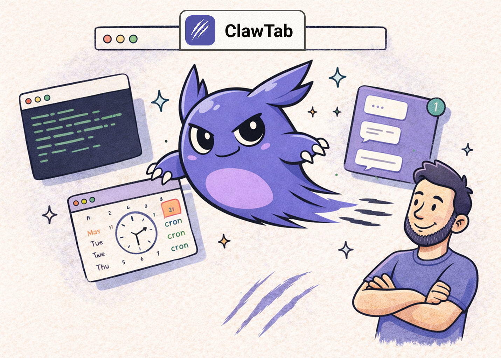

<p align="center">
  
</p>

<h3 align="center">Schedule and control Claude Code agent swarms</h3>

<p align="center">
  A macOS app for running automated Claude Code agents on a cron schedule, monitoring them across tmux panes, and answering their questions remotely from your phone or browser.
</p>

<p align="center">
  <a href="https://clawtab.cc">Website</a> &middot;
  <a href="./docs/">Documentation</a>
</p>

---

## Features

- **Remote Agent Control** -- Detect when agents are asking questions, see them as cards, and answer with one tap from your phone or browser.
- **Tmux Execution** -- Jobs run inside tmux windows. Output is captured, monitored, and logged. Pane splitting for concurrent runs.
- **Cron Scheduling** -- Standard cron expressions with a 30-second polling loop. Run on schedule, manually, or via CLI.
- **Secrets Management** -- Secrets from macOS Keychain and gopass, injected as environment variables. Per-job secret assignment.
- **Telegram Integration** -- Real-time output relay, completion notifications, and an agent mode for remote job control via bot commands.
- **Three Interfaces** -- GUI menu bar app, `cwtctl` CLI, and `cwttui` terminal UI. All connected via IPC socket.

<p align="center">
  
</p>

## Controlling Agent Swarms Remotely

<p align="center">
  
</p>

- **Auto-detect questions** - Detects when Claude Code agents are waiting for input across your tmux panes.
- **Unified card view** - See all pending questions from all instances in one interface.
- **One-tap answers** - Answer options are rendered as buttons. Tap to send the response back to the agent.
- **Multi-instance support** - Works across multiple terminal windows and tmux panes simultaneously.

Works on web, desktop, and soon mobile.

**Architecture:** A relay server (Rust/Axum) sits between your local machine and remote clients. The desktop app (Tauri) monitors your tmux panes, parses Claude Code output to detect when an agent is waiting for input, and pushes the state to the relay. The web/mobile client connects to the relay, renders agent cards with answer buttons, and sends responses back through the relay to your terminal.

Desktop (Tauri) -> Relay Server (Rust/Axum) -> Web/Mobile Client

## How It Works

1. **Define Jobs** -- Create jobs in the GUI: shell scripts, Claude Code prompts, or project folders with `.cwt` instructions.
2. **ClawTab Schedules** -- Jobs run on cron in tmux windows. Secrets are injected, output is captured, and status is tracked.
3. **Monitor Anywhere** -- Watch from the GUI, CLI, TUI, or Telegram. Get notifications on success or failure.

## Install

### Homebrew

```sh
brew install --cask tonisives/tap/clawtab
```

### Build from Source

Requires macOS 10.15+, [Rust](https://rustup.rs/), [Node.js](https://nodejs.org/), and [pnpm](https://pnpm.io/).

```sh
git clone https://github.com/tonisives/clawdtab.git
cd clawdtab
pnpm install
cargo tauri build
```

Produces three binaries: `clawtab` (GUI), `cwtctl` (CLI), `cwttui` (TUI).

### Runtime Dependencies

- tmux (for Claude Code and folder jobs)
- Claude Code CLI (for AI jobs)

## Documentation

Full docs are available in the [docs/](./docs/) folder or at [clawtab.cc](https://clawtab.cc).

## License

See [LICENSE](./LICENSE) for details.
