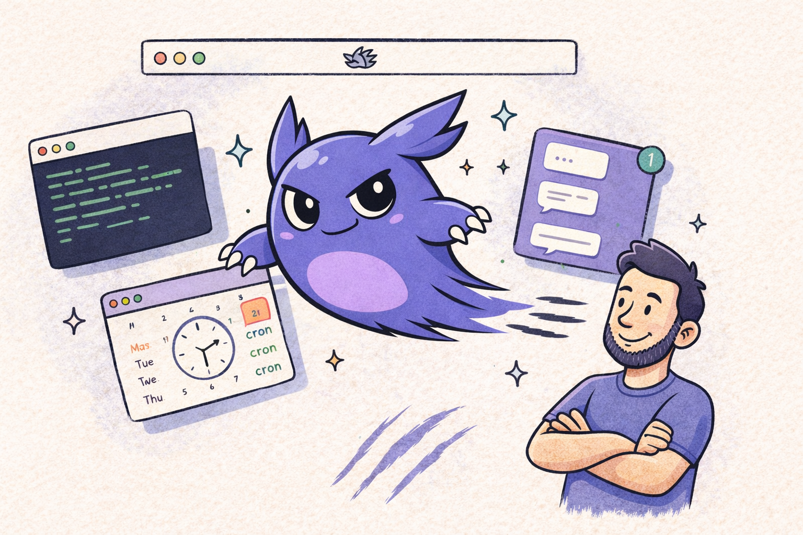

<p align="center">
  
</p>

<h3 align="center">Schedule Claude Code agents from your menu bar</h3>

<p align="center">
  A macOS app for running automated Claude Code jobs, shell scripts, and project-based AI agents on a cron schedule, all orchestrated through tmux.
</p>

<p align="center">
  <a href="https://clawtab.cc">Website</a> &middot;
  <a href="./docs/">Documentation</a>
</p>

---

## Features

- **Three Job Types** -- Run shell scripts (binary), Claude Code prompts, or project-based folder agents with `.cwt` directories.
- **Tmux Execution** -- Jobs run inside tmux windows. Output is captured, monitored, and logged. Pane splitting for concurrent runs.
- **Cron Scheduling** -- Standard cron expressions with a 30-second polling loop. Run on schedule, manually, or via CLI.
- **Secrets Management** -- Secrets from macOS Keychain and gopass, injected as environment variables. Per-job secret assignment.
- **Telegram Integration** -- Real-time output relay, completion notifications, and an agent mode for remote job control via bot commands.
- **Three Interfaces** -- GUI menu bar app, `cwtctl` CLI, and `cwttui` terminal UI. All connected via IPC socket.

## How It Works

1. **Define Jobs** -- Create jobs in the GUI: shell scripts, Claude Code prompts, or project folders with `.cwt` instructions.
2. **ClawTab Schedules** -- Jobs run on cron in tmux windows. Secrets are injected, output is captured, and status is tracked.
3. **Monitor Anywhere** -- Watch from the GUI, CLI, TUI, or Telegram. Get notifications on success or failure.

## Install

### Homebrew

```sh
brew install --cask tonisives/tap/clawtab
```

### Build from Source

Requires macOS 10.15+, [Rust](https://rustup.rs/), [Node.js](https://nodejs.org/), and [pnpm](https://pnpm.io/).

```sh
git clone https://github.com/tonisives/clawdtab.git
cd clawdtab
pnpm install
cargo tauri build
```

Produces three binaries: `clawtab` (GUI), `cwtctl` (CLI), `cwttui` (TUI).

### Runtime Dependencies

- tmux (for Claude Code and folder jobs)
- Claude Code CLI (for AI jobs)

## Documentation

Full docs are available in the [docs/](./docs/) folder or at [clawtab.cc](https://clawtab.cc).

## License

See [LICENSE](./LICENSE) for details.
