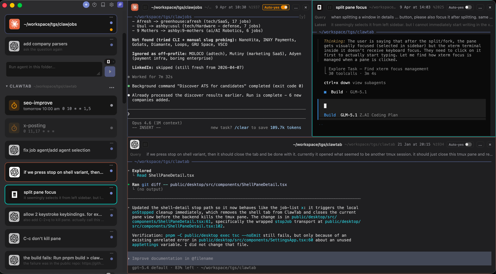
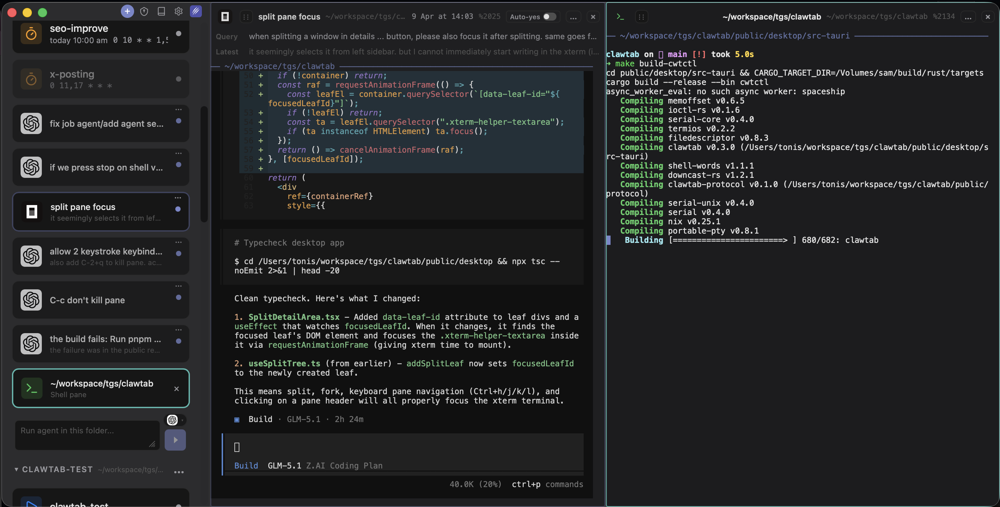

<h3 align="center">ClawTab - Agent Control Center</h3>

  Desktop app for creating and managing groups of agents from any provider and monitoring them on the web or mobile.

  

  <a href="https://clawtab.cc">Website</a> &middot;
  <a href="./docs/">Documentation</a>

---

## Features

- Claude Code, Codex and OpenCode support
- Split Agents into side-by-side panes
- Display info about agent, task, and queries
- Auto-yes - accept all questions as `Yes`
- Scheduled jobs - create crons and read their past logs
- Keep agents running in background and return at a later date
- Remote Control - answer questions on web or ClawTab mobile app
- Notifications - job failures or agent questions to mobile or Telegram
- Secrets Management - Secrets from macOS Keychain and gopass, injected as environment variables. Per-job secret assignment.

## Full terminal support

ClawTab uses [xterm](https://github.com/xtermjs/xterm.js) to display full interface of the Agent. You can 
- answer agent uestions
- edit in nvim
- use your full shell configuration

You can launch normal shells beside agents and run shell commands manually

  

## Remote Control

- **Auto-detect questions** - Detects when Claude Code agents are waiting for input across your panes.
- **Unified card view** - See all pending questions from all instances in one interface.
- **One-tap answers** - Answer options are rendered as buttons. Tap to send the response back to the agent.
- **Multi-instance support** - Works across multiple terminal windows, agents providers and tabs simultaneously.

  

**Architecture:** A relay server (Rust/Axum) sits between your local machine and remote clients. The desktop app (Tauri) monitors your tmux panes, parses CLI output to detect when an agent is waiting for input, and pushes the state to the relay.

The web/mobile client connects to the relay, renders agent cards with answer buttons, and sends responses back through the relay to your terminal.

Desktop (Tauri) -> Relay Server (Rust/Axum) -> Web/Mobile Client

## How It Works

1. **Launch Agents** -- Launch any Agent software from single interface. Combine them into groups and split panes for project overview
2. **Define Jobs** -- Create jobs in the GUI: Agent prompts, or project-based folder agents with centralized instructions.

## FAQ

### Why not just use tmux or other multiplexers? 

ClawTab adds info about agent tasks, groups them together for projects, searches between them, and launches them in single interface. Tmux goes a long way, but gets harder to manage when workload increases.

### What is the difference between OpenClaw and ClawTab?
ClawTab includes many of OpenClaw features like autonomous agents, scheduled jobs and remote notifications. Main benefit is the full Desktop/Remote app that allows you to orchestrate agents visually.

### Why not just use Claude Code?
With Claude Code, you are locked into a single provider. Anthropic and ChatGPT are known to reduce model quality or increase pricing without prior notice. ClawTab allows you to be provider agnostic and prepare for model downtime. I use 3 different providers so I stay in control.

### What is the pricing?
Desktop app is MIT licensed and completely free. If you want to use Remote features, you can deploy the relay yourself for free or use the provided subscription.

