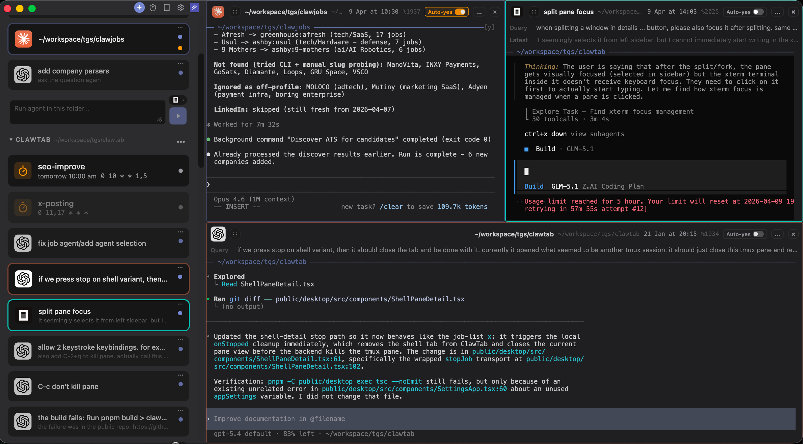

<p align="center">
  
</p>

<h3 align="center">Desktop Agent Control Center</h3>

<p align="center">
  A desktop app for creating and managing groups of agents and monitoring them on the web and mobile. 
</p>

<p align="center">
  <a href="https://clawtab.cc">Website</a> &middot;
  <a href="./docs/">Documentation</a>
</p>

---

## Features

- Claude Code, Codex and OpenCode support
- Split the CLI software into multiple panes
- Extract job first and latest query and start times
- Return to agents at a later date
- Run scheduled jobs, read their past logs
- Remote Agent Control - answer questions on web or ClawTab mobile app.
- Get notifications on job failures or agent questions on mobile or Telegram
- Secrets Management -- Secrets from macOS Keychain and gopass, injected as environment variables. Per-job secret assignment.

<p align="center">
  
</p>

## Controlling Agent Swarms Remotely

<p align="center">
  
</p>

- **Auto-detect questions** - Detects when Claude Code agents are waiting for input across your tmux panes.
- **Unified card view** - See all pending questions from all instances in one interface.
- **One-tap answers** - Answer options are rendered as buttons. Tap to send the response back to the agent.
- **Multi-instance support** - Works across multiple terminal windows and tmux panes simultaneously.

Works on web, desktop, and soon mobile.

**Architecture:** A relay server (Rust/Axum) sits between your local machine and remote clients. The desktop app (Tauri) monitors your tmux panes, parses Claude Code output to detect when an agent is waiting for input, and pushes the state to the relay. The web/mobile client connects to the relay, renders agent cards with answer buttons, and sends responses back through the relay to your terminal.

Desktop (Tauri) -> Relay Server (Rust/Axum) -> Web/Mobile Client

## How It Works

1. **Define Jobs** -- Create jobs in the GUI: shell scripts, Claude Code prompts, or project-based folder agents with centralized instructions.
2. **Start Agents** -- Built in UI to choose agent provider and launch any of them from single UI
3. **ClawTab Schedules** -- Jobs run on cron in tmux windows. Secrets are injected, output is captured, and status is tracked.
4. **Monitor Anywhere** -- Watch from the GUI, Web App, Mobile App or Telegram. Get notifications on success or failure.

## Save costs

Mix and match between providers. Use Claude promotion period to get cheap tokens. Switch to ChatGPT when they are promoting their product. Switch to OpenCode when both tokens are exhausted and wait for the next reset.

## Install

### Homebrew

```sh
brew install --cask tonisives/tap/clawtab
```

### Build from Source

Requires macOS 10.15+, [Rust](https://rustup.rs/), [Node.js](https://nodejs.org/), and [pnpm](https://pnpm.io/).

```sh
git clone https://github.com/tonisives/clawdtab.git
cd clawdtab
pnpm install
cargo tauri build
```

Produces three binaries: `clawtab` (GUI), `cwtctl` (CLI), `cwttui` (TUI).

### Runtime Dependencies

- tmux (for Claude Code and folder jobs)
- Claude Code CLI (for AI jobs)

## iOS App

Download from the [App Store](https://apps.apple.com/us/app/clawtab/id6759683841)

## Web remote

Access at https://remote.clawtab.cc

## Documentation

Full docs are available in the [docs/](./docs/) folder or at [clawtab.cc](https://clawtab.cc).

## License

See [LICENSE](./LICENSE) for details.
