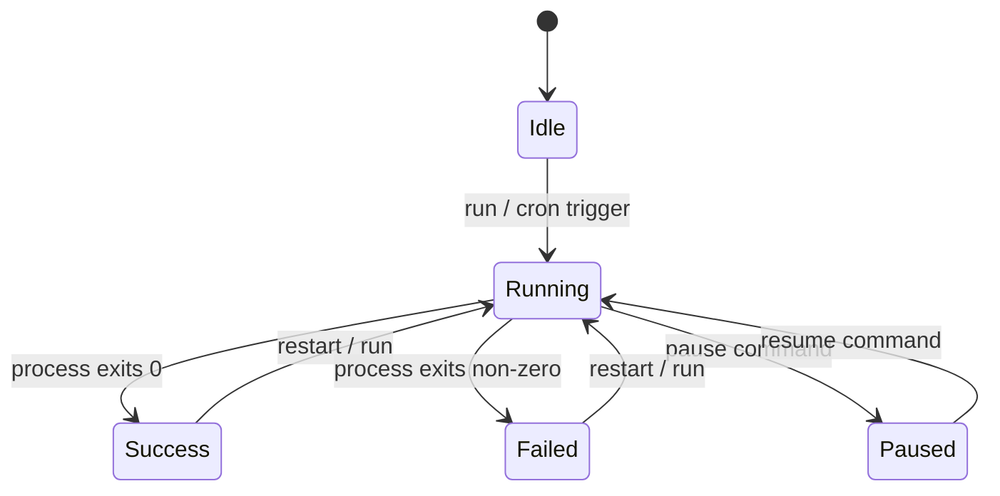

# Job Types

## Binary

Executes a shell script or binary directly as a child process.

```yaml
job_type: binary
path: /scripts/backup.sh
args: ["--full", "--quiet"]
```

- Runs with `stdout`/`stderr` piped and captured
- Environment: `PATH` + `HOME` inherited, plus `env` and `secret_keys`
- Completes when the process exits
- Exit code stored in history

## Claude

Runs the Claude Code CLI with a prompt from a file, inside a tmux window.

```yaml
job_type: claude
path: /prompts/review-pr.txt
```

Execution command sent to tmux:

```bash
cd /work/dir && claude "$(cat /prompts/review-pr.txt)"
```

Secrets are injected as tmux environment variables via `-e KEY=VALUE` flags on window/pane creation, not as shell `export` prefixes.

- Creates tmux window `cwt-<project>` in the configured session (project is derived from the slug prefix, e.g. slug `myapp/review` produces window `cwt-myapp`)
- If the window already exists, splits a new pane instead
- Output monitored asynchronously (see [Monitoring](#tmux-monitoring))

## Folder

Project-based AI agent using a `.cwt/` directory structure. Each project can have multiple jobs (e.g., deploy, lint, analyze), each in its own subfolder within `.cwt/`.

```yaml
job_type: folder
folder_path: /projects/myapp/.cwt
job_name: deploy    # subfolder name within .cwt/
```

### .cwt Directory Structure

```
myproject/
  .cwt/
    cwt.md              # user-written shared context for all jobs in this project
    browse.sh           # auto-generated Safari automation helper
    send.sh             # auto-generated Telegram send helper (if Telegram configured)
    deploy/
      job.md            # job-specific prompt (you write this)
      cwt.md            # auto-generated per-job context
      extract.js        # optional JS for browse.sh jsfile
    lint/
      job.md
      cwt.md
```

**`.cwt/cwt.md`** (root) -- You write this. Shared context available to all jobs in the project.

**`.cwt/{job-name}/job.md`** -- You write this. Contains the prompt/instructions for one specific job.

**`.cwt/{job-name}/cwt.md`** -- Auto-generated by ClawTab on job save, settings change, or app startup. Contains:
- Job-specific context (name, environment, tools)
- Reference to shared context

If `job_name` is not set, it defaults to `"default"`, placing files at `.cwt/default/job.md`.

Execution command sent to tmux:

```bash
cd /projects/myapp && claude $'@.cwt/cwt.md @.cwt/deploy/cwt.md @.cwt/deploy/job.md\n\n<job.md content>'
```

Secrets are injected as tmux environment variables (same as Claude jobs).

The job runs from the project root (parent of `.cwt/`), not from inside `.cwt/`.

## Tmux Monitoring

Claude and Folder jobs are monitored asynchronously after launch:

```
1s wait (process startup)
  |
  v
Two concurrent loops:
  1. Fast exit poller (every 200ms)
     └── Checks if pane process has exited (shell prompt returned)
  2. Content poller (every 2s)
     ├── Capture last 80 lines
     ├── Diff against previous capture
     └── Relay new output to Telegram (if configured)
  |
  v
Process exit detected:
  ├── Capture full scrollback
  ├── Save to ~/.config/clawtab/jobs/<slug>/logs/<run-id>.log
  ├── Update history record
  ├── Kill the tmux pane
  ├── Set status to Success
  └── Send completion notification
```

## Job Lifecycle



## Environment & Secrets

All job types inject environment variables in this order:

1. `PATH` and `HOME` from the parent process
2. Static `env` map from job definition
3. Secrets from `secret_keys` (keychain lookup, then gopass fallback)
4. `TELEGRAM_BOT_TOKEN` auto-injected if job has `telegram_chat_id` set

For tmux jobs (Claude/Folder), secrets are injected via tmux's `-e KEY=VALUE` flags when creating windows or splitting panes. This sets them as environment variables in the shell without exposing them in the command string.

## Aerospace Integration

If a job has `aerospace_workspace` set and [AeroSpace](https://github.com/nikitabobko/AeroSpace) is installed, the tmux window is moved to that workspace after creation.
