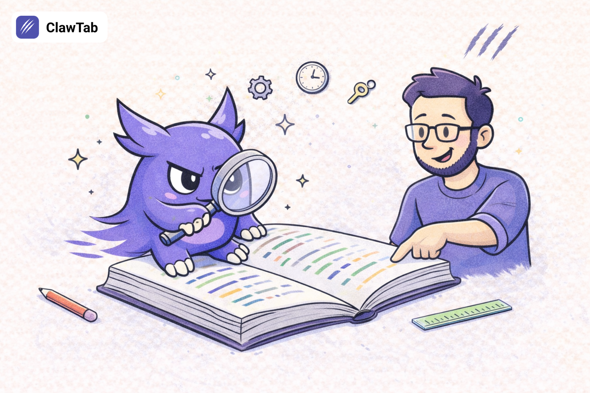

# ClawTab Documentation

ClawTab is a macOS desktop app for scheduling and managing automated jobs -- shell scripts, Claude Code prompts, and project-based AI agents -- all orchestrated through tmux.

## Table of Contents

### Getting Started
1. [Quick Start](./quick-start.md) -- Installation, setup wizard, first job
2. [Configuration](./configuration.md) -- Settings, job definitions, file locations

### Usage
3. [Job Types](./job-types.md) -- Binary, Claude, and Folder jobs
4. [Secrets](./secrets.md) -- Keychain and gopass integration
5. [Telegram](./telegram.md) -- Notifications and agent mode
6. [CLI & TUI](./cli-tui.md) -- Command-line and terminal UI

### Reference
7. [Architecture](./architecture.md) -- System design, execution flow, IPC
8. [File Reference](./file-reference.md) -- Config paths, schemas, log locations
