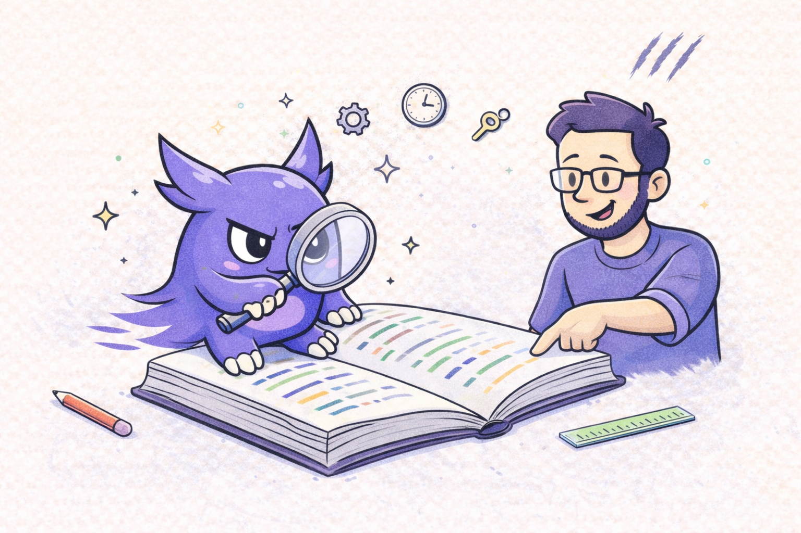

# ClawTab Documentation

ClawTab is a macOS desktop app for scheduling and managing automated jobs -- shell scripts, Claude Code prompts, and project-based AI agents -- all orchestrated through tmux.

## Table of Contents

### Getting Started
1. [Quick Start](./quick-start.md) -- Installation, setup wizard, first job
2. [Configuration](./configuration.md) -- Settings, job definitions, file locations

### Usage
3. [Job Types](./job-types.md) -- Binary, Claude, and Folder jobs
4. [Secrets](./secrets.md) -- Keychain and gopass integration
5. [Telegram](./telegram.md) -- Notifications and agent mode
6. [CLI & TUI](./cli-tui.md) -- Command-line and terminal UI
7. [Vim / Tmux Navigation](./vim-tmux-navigation.md) -- Share Ctrl-hjkl across vim, tmux, and ClawTab panes

### Remote Access
8. [Remote Access](./remote.md) -- Control jobs from your phone via relay server
9. [Workspace Sharing](./sharing.md) -- Share your workspace with colleagues
10. [Self-Hosted Deployment](./deploy.md) -- Run your own relay, PostgreSQL, and frontend

### Reference
11. [Architecture](./architecture.md) -- System design, execution flow, IPC
12. [Project Layout](./project-layout.md) -- Repository structure (relay, mobile, protocol)
13. [File Reference](./file-reference.md) -- Config paths, schemas, log locations
