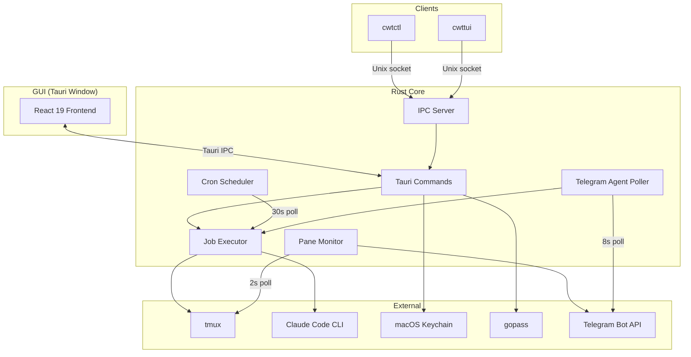
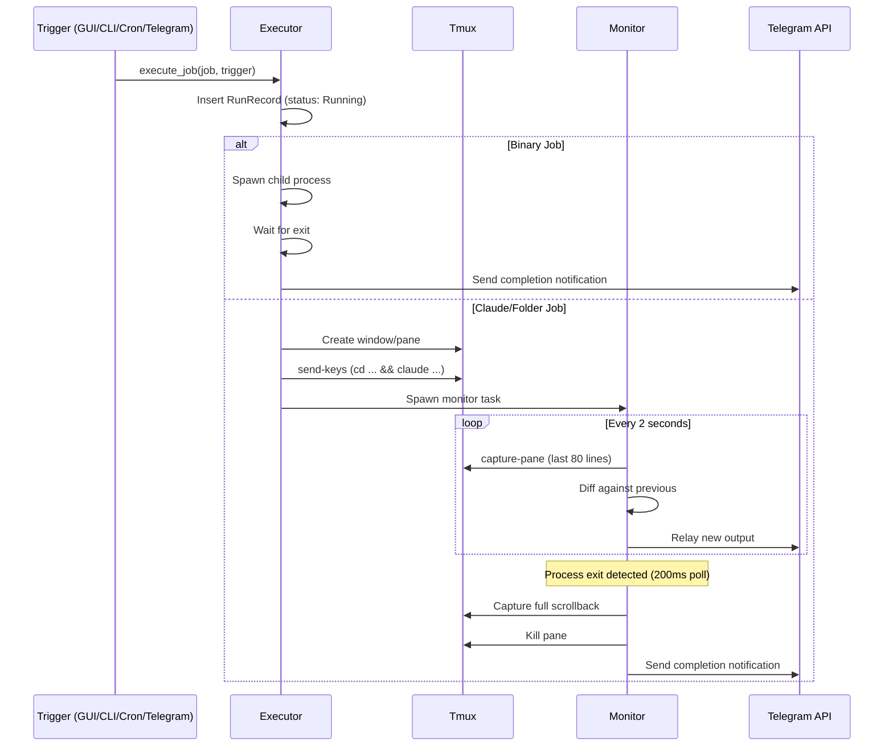

# Architecture

## Overview



## Tech Stack

| Layer | Technology |
|-------|-----------|
| Desktop framework | Tauri 2 |
| Frontend | React 19, TypeScript, Vite 7 |
| Core | Rust, Tokio |
| Serialization | serde_yml (config), serde_json (IPC) |
| Cron parsing | `cron` crate |
| HTTP client | reqwest (Telegram API) |
| TUI | ratatui + crossterm |

## Shared State

All mutable state is wrapped in `Arc<Mutex<T>>` and shared across the scheduler, executor, IPC handler, and Tauri commands:

```rust
AppState {
    jobs_config:  Arc<Mutex<JobsConfig>>,
    settings:     Arc<Mutex<AppSettings>>,
    secrets:      Arc<Mutex<SecretsManager>>,
    history:      Arc<Mutex<HistoryStore>>,
    job_status:   Arc<Mutex<HashMap<String, JobStatus>>>,
}
```

MutexGuards are always dropped before any `.await` to satisfy Rust's `Send` bounds.

## Execution Flow



## Source Layout

```
src-tauri/src/
  lib.rs                    # App state, IPC handler, Tauri setup
  main.rs                   # Entry point
  ipc.rs                    # Unix socket server/client
  config/
    mod.rs                  # Config dir: ~/.config/clawtab/
    jobs.rs                 # Job schema, folder-based storage, slug generation
    settings.rs             # AppSettings schema + persistence
  commands/
    jobs.rs                 # Job CRUD, run/pause/resume/restart
    history.rs              # History queries
    secrets.rs              # Secret management
    settings.rs             # Settings get/set
    telegram.rs             # Telegram config + setup polling
    status.rs               # Job status queries
    tmux.rs                 # Tmux session/window operations
    tools.rs                # Tool detection + installation
    aerospace.rs            # Aerospace workspace listing
  scheduler/
    mod.rs                  # 30s cron polling loop
    executor.rs             # Job execution (binary/claude/folder)
    monitor.rs              # Tmux pane monitoring + log capture
  secrets/
    mod.rs                  # SecretsManager (unified lookup)
    keychain.rs             # macOS Keychain backend
    gopass.rs               # Gopass backend
  telegram/
    mod.rs                  # Send messages, notify, config struct
    commands.rs             # Agent command parsing + formatting
    polling.rs              # Long-poll getUpdates loop
    types.rs                # Telegram API types
  tmux/mod.rs               # tmux command wrappers
  cwt/mod.rs                # .cwt folder handling
  aerospace/mod.rs          # AeroSpace integration
  history/mod.rs            # Run history store
  tools/mod.rs              # Tool detection
  terminal/mod.rs           # Terminal emulator integration
  bin/
    ctl.rs                  # cwtctl CLI
    tui.rs                  # cwttui TUI

src/
  settings.tsx              # Frontend entry point
  types.ts                  # TypeScript interfaces (mirrors Rust structs)
  components/
    SettingsApp.tsx          # Main tabbed UI
    SetupWizard.tsx          # First-run wizard
    JobsPanel.tsx            # Job list + management
    JobEditor.tsx            # Job creation/editing form
    SecretsPanel.tsx         # Secret management
    TelegramPanel.tsx        # Telegram settings
    TelegramSetup.tsx        # Telegram bot setup flow
    GeneralSettings.tsx      # App preferences
    ToolsPanel.tsx           # Tool detection + install
    CronInput.tsx            # Cron expression editor
    LogViewer.tsx            # Run log display
```

## Build Constraints

- `warnings = "deny"` and `unused = "deny"` in `Cargo.toml` -- dead code is a compile error
- Tauri command parameters: camelCase in JavaScript maps to snake_case in Rust
