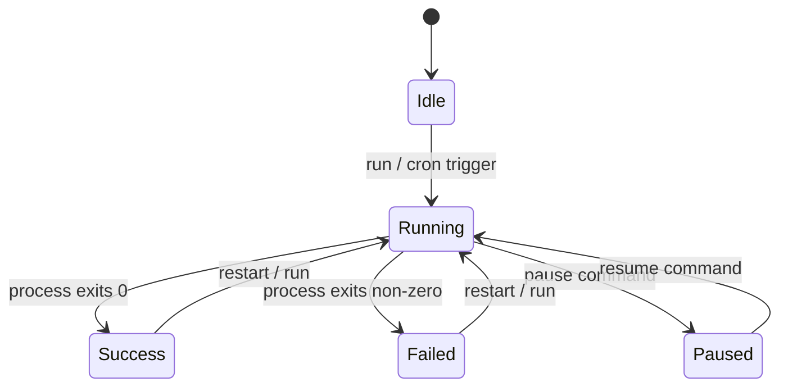

# Job Types

## Binary

Executes a shell script or binary directly as a child process.

```yaml
job_type: binary
path: /scripts/backup.sh
args: ["--full", "--quiet"]
```

- Runs with `stdout`/`stderr` piped and captured
- Environment: `PATH` + `HOME` inherited, plus `env` and `secret_keys`
- Completes when the process exits
- Exit code stored in history

## Claude

Runs the Claude Code CLI with a prompt from a file, inside a tmux window.

```yaml
job_type: claude
path: /prompts/review-pr.txt
```

Execution command sent to tmux:

```bash
export SECRET_KEY='value' && cd /work/dir && claude "$(cat /prompts/review-pr.txt)"
```

- Creates tmux window `cm-<job-name>` in the configured session
- If the window already has an active process, splits a new pane instead
- Output monitored asynchronously (see [Monitoring](#tmux-monitoring))

## Folder

Project-based AI agent using a `.cwt/` directory structure.

```yaml
job_type: folder
folder_path: /projects/myapp/.cwt
```

### .cwt Directory Structure

```
myproject/
  .cwt/
    job.md          # required -- agent instructions/prompt
    cwt.md         # auto-generated -- agent context (jobs, secrets, tools)
    helper.sh       # optional -- additional scripts
    analyze.py      # optional
```

**`job.md`** -- You write this. Contains the prompt/instructions for Claude.

**`cwt.md`** -- Auto-generated by ClawdTab on job save, settings change, or app startup. Contains:
- Agent profile / system message
- List of all configured jobs with details
- Available secrets
- Configured tools

Execution command sent to tmux:

```bash
export SECRET_KEY='value' && cd /projects/myapp && claude $'@.cwt/cwt.md @.cwt/job.md\n\n<job.md content>'
```

The job runs from the project root (parent of `.cwt/`), not from inside `.cwt/`.

## Tmux Monitoring

Claude and Folder jobs are monitored asynchronously after launch:

```
3s wait (process startup)
  |
  v
Poll pane every 5s
  ├── Capture last 80 lines
  ├── Diff against previous capture
  ├── Relay new output to Telegram (if configured)
  └── Track idle ticks (no change + no active process)
  |
  v
5 idle ticks = job complete
  ├── Capture full scrollback
  ├── Save to ~/.config/clawdtab/jobs/<slug>/logs/<run-id>.log
  ├── Update history record
  ├── Set status to Success
  └── Send completion notification
```

## Job Lifecycle



## Environment & Secrets

All job types inject environment variables in this order:

1. `PATH` and `HOME` from the parent process
2. Static `env` map from job definition
3. Secrets from `secret_keys` (keychain lookup, then gopass fallback)
4. `TELEGRAM_BOT_TOKEN` auto-injected if job has `telegram_chat_id` set

For tmux jobs (Claude/Folder), secrets are injected via an `export K=V && ...` prefix prepended to the command. Values are shell-escaped.

## Aerospace Integration

If a job has `aerospace_workspace` set and [AeroSpace](https://github.com/nikitabobko/AeroSpace) is installed, the tmux window is moved to that workspace after creation.
