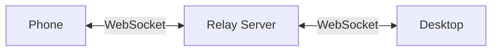
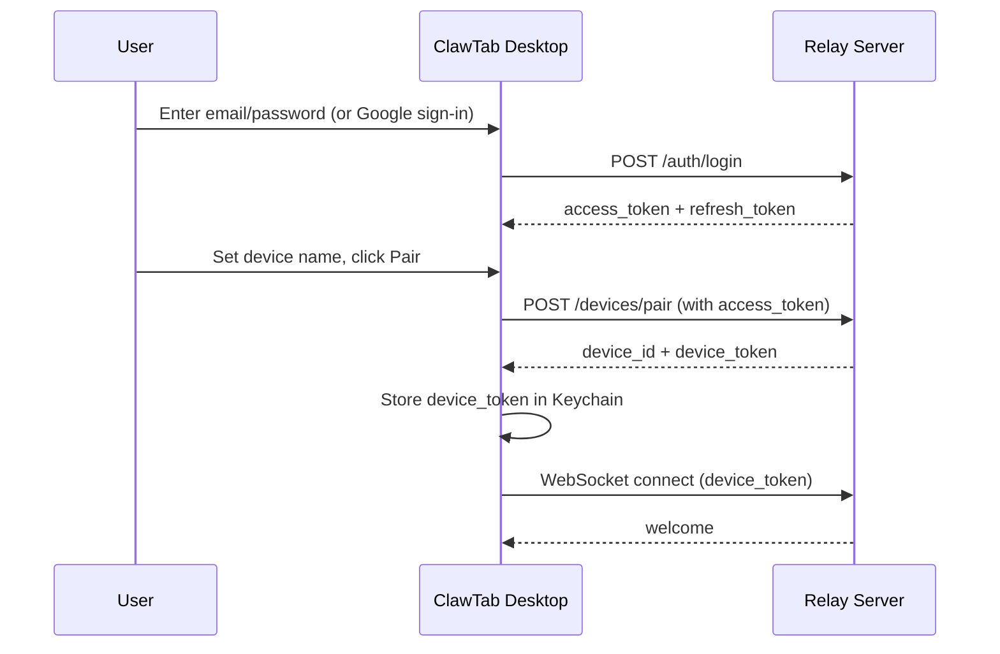
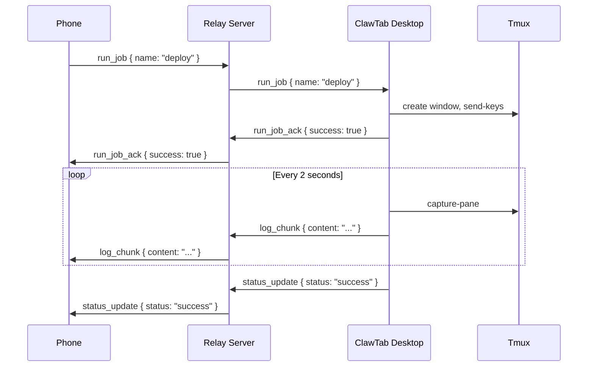
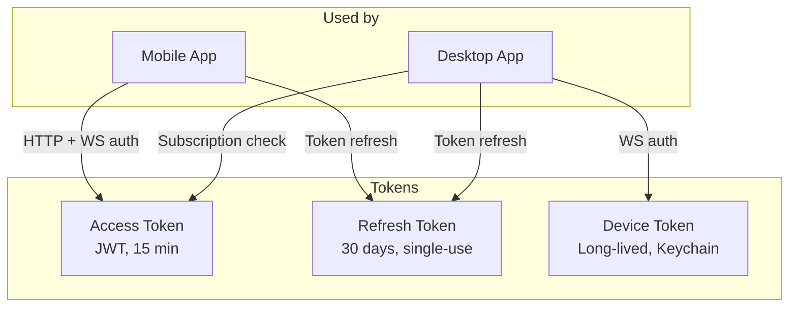
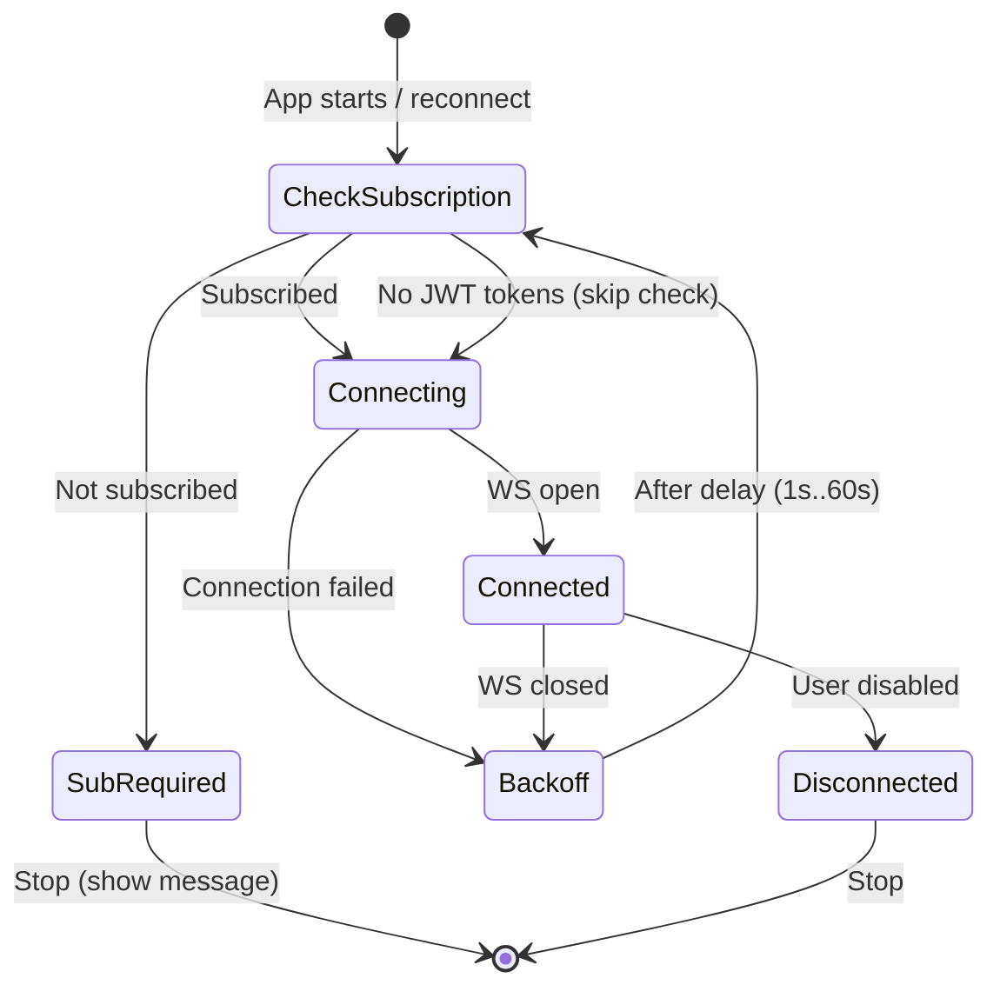

# Remote Access

ClawTab can be controlled from your phone through a relay server. The desktop app maintains a persistent WebSocket connection to the relay, and the mobile app connects to the same relay to send commands and receive live updates.

## How it works

The relay server acts as a message broker. Your phone sends commands (run job, pause, view logs), the relay forwards them to your desktop, and the desktop sends back results. All communication is authenticated and encrypted over TLS.

The hosted relay is at `https://relay.clawtab.cc`. You can also self-host the relay server.

## Agent Question Detection

When running multiple Claude Code agents across tmux panes, each agent may pause to ask questions (file permissions, approach decisions, clarifications). ClawTab detects these automatically by parsing the terminal output of each pane.

Detected questions appear as cards in the mobile/web interface. Each card shows the agent name, the question text, and the available answer options as tappable buttons. Selecting an answer sends the keystroke back through the relay to the correct tmux pane, resuming the agent.

This lets you run a swarm of agents and handle all their questions from your phone without switching between terminal windows.

## Setup

The Remote tab in ClawTab walks you through a two-step process:

### 1. Log in

Create an account or sign in with Google. This gives the desktop an access token to register itself as a device.

Email/password and Google OAuth are both supported. Google sign-in opens your browser and redirects back to ClawTab via a deep link.

### 2. Pair this device

Give your machine a name (defaults to your hostname). ClawTab registers it with the relay server and receives a device token. This token is stored in your macOS Keychain and used for all future connections.

After pairing, the desktop connects to the relay automatically on app start.

## Mobile app

Install the ClawTab mobile app and sign in with the same account. Your paired desktop(s) appear with their online/offline status. From the mobile app you can:

- View all jobs with their current status
- Run, pause, resume, and stop jobs
- Stream live log output
- Send input to running jobs
- View run history
- Create new jobs
- Run agent prompts

## Message flow

When you tap "Run" on your phone, this is what happens:

## Connection status

The Remote panel shows the current connection state:

| Status | Meaning |
|--------|---------|
| Connected (green) | Desktop is connected to the relay and reachable from mobile |
| Disconnected (gray) | Not connected -- the app will retry automatically with backoff |
| Subscription required (amber) | No active subscription found |

The "Enable remote access" checkbox lets you toggle the connection without removing your configuration.

## Authentication

Three types of tokens are used:

- **Access tokens** - JWT, expire after 15 minutes. Used by mobile for all authenticated requests and by desktop for subscription checks. Refreshed automatically.
- **Refresh tokens** - last 30 days, single-use. Include stolen-token detection: if a refresh token is reused, all tokens for the account are revoked.
- **Device tokens** - long-lived credentials stored in the macOS Keychain. Used by the desktop to authenticate its WebSocket connection. Created during device pairing.

Both the desktop and mobile clients handle token refresh transparently. If a request fails with 401, the client refreshes the token and retries.

## Connection lifecycle

On startup, the desktop reads its device token from keychain and relay settings from config. If enabled, it enters the connect loop:

1. Check subscription status via HTTP (if JWT tokens are available)
2. If not subscribed, set the "subscription required" flag and stop
3. Attempt WebSocket connection with device token
4. On success, push full job state to relay
5. On disconnect, back off exponentially (1s, 2s, 4s, ... up to 60s) and retry from step 1

The mobile app follows the same pattern: check subscription, then connect. It also reconnects when the app returns to foreground.

## Protocol

The desktop and mobile communicate through JSON messages over WebSocket. The relay forwards messages between them without inspecting the content (beyond routing).

### Commands (mobile to desktop)

| Message | Description |
|---------|-------------|
| `list_jobs` | Request full job list with statuses |
| `run_job` | Trigger a job by name |
| `pause_job` | Pause a running job |
| `resume_job` | Resume a paused job |
| `stop_job` | Stop a running job |
| `send_input` | Send text input to a running job's tmux pane |
| `subscribe_logs` | Start streaming live output for a job |
| `unsubscribe_logs` | Stop streaming |
| `get_run_history` | Fetch past runs for a job |
| `run_agent` | Run a free-form agent prompt |
| `create_job` | Create a new job |

### Updates (desktop to mobile)

| Message | Description |
|---------|-------------|
| `jobs_changed` | Full job list + statuses (sent on connect and when config changes) |
| `status_update` | Single job status change |
| `log_chunk` | Live output from a running job |

### Server messages

| Message | Description |
|---------|-------------|
| `welcome` | Sent on connect with connection ID and server version |
| `desktop_status` | Notifies mobile when a desktop comes online or goes offline |
| `error` | Error with code (`DESKTOP_OFFLINE`, `UNAUTHORIZED`, `SUBSCRIPTION_EXPIRED`, etc.) |

## Subscription

The hosted relay requires an active subscription to establish WebSocket connections. Both clients check subscription status via `GET /subscription/status` before connecting. If the check fails, they show "Subscription required" instead of silently retrying.

Self-hosted relay instances can set `SELF_HOSTED=true` to skip subscription checks entirely.

## Self-hosting

The relay server is a standalone Rust binary. Required configuration:

| Variable | Description |
|----------|-------------|
| `DATABASE_URL` | PostgreSQL connection string |
| `JWT_SECRET` | Secret for signing access tokens |
| `LISTEN_ADDR` | Bind address (default: `0.0.0.0:8080`) |
| `SELF_HOSTED` | Set to `true` to allow all users without subscription |

Optional:

| Variable | Description |
|----------|-------------|
| `GOOGLE_CLIENT_ID` | Enables Google OAuth |
| `GOOGLE_CLIENT_SECRET` | Enables Google OAuth |
| `CORS_ORIGINS` | Comma-separated allowed origins |
| `MAX_CONNECTIONS_PER_USER` | Default: 5 |

Run the database migrations, start the binary, and point your ClawTab desktop at your server URL during setup.

## Removing relay configuration

The Danger Zone at the bottom of the Remote panel removes all relay configuration (device token, server URL) and disconnects. You will need to log in and pair again.
