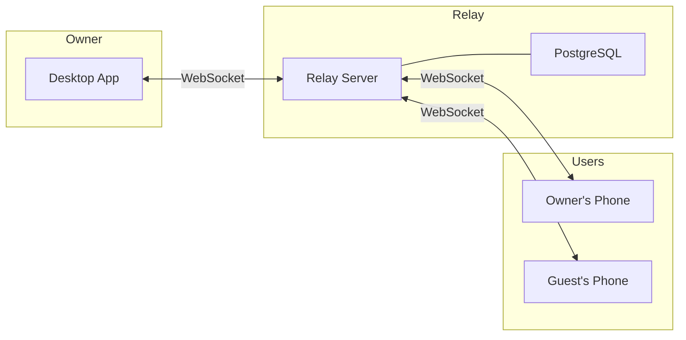
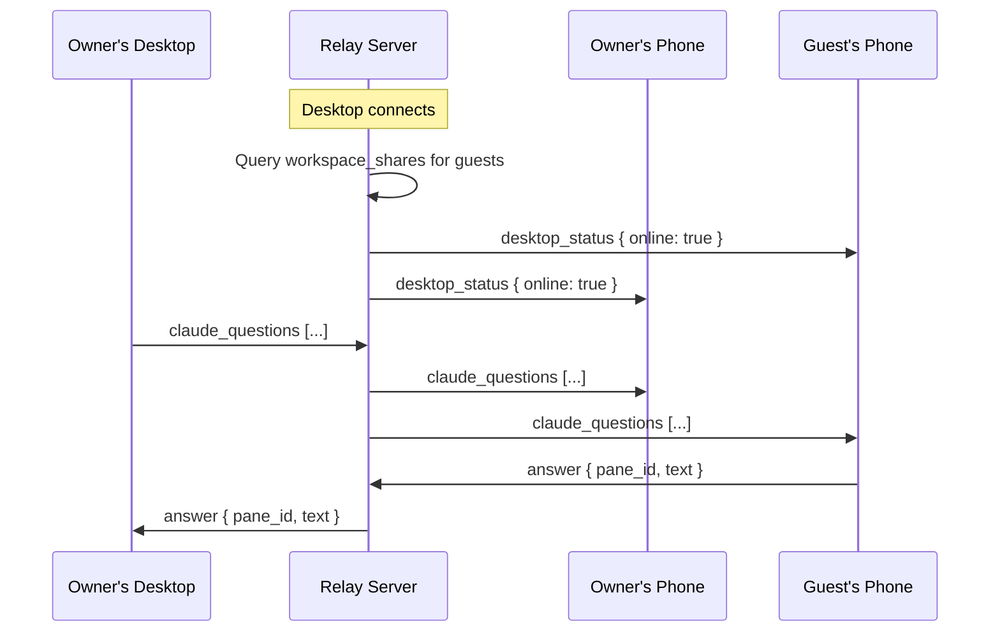
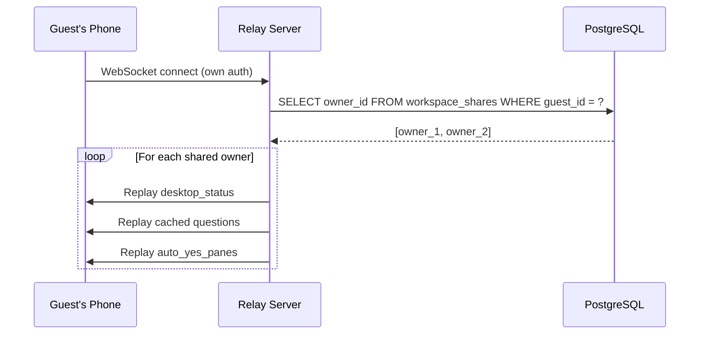
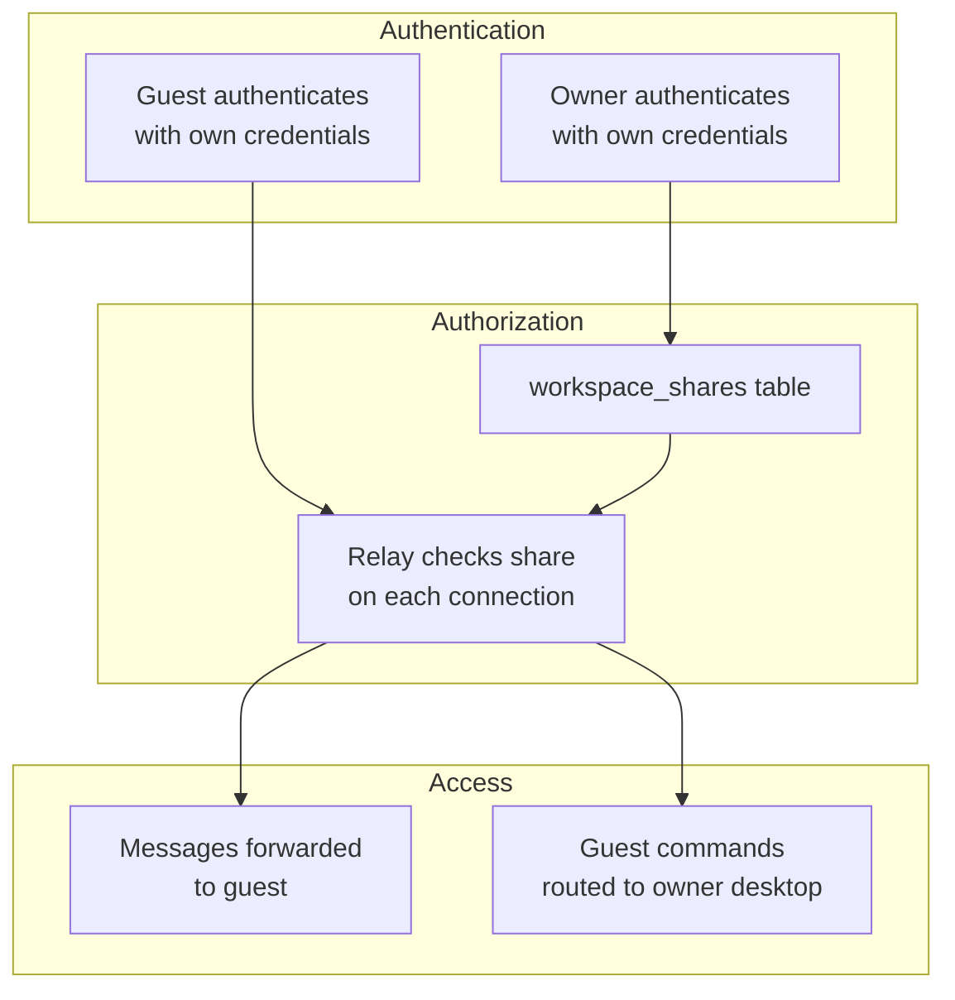

# Workspace Sharing

ClawTab lets you share your workspace with other users so they can monitor your desktop, view and respond to agent questions, and send commands to your machine - all through their own ClawTab account.

## Overview



When you share your workspace, the relay server forwards your desktop's messages to both your mobile connection and the guest's mobile connection. The guest sees the same real-time view you do: desktop status, job updates, agent questions, and log output.

## Adding a share

Open the ClawTab mobile app or web interface at `remote.clawtab.cc`. Go to **Settings > Shared Access**, enter the email address of the person you want to share with, and tap **Share**.

The person must already have a ClawTab account. The share takes effect immediately - no approval flow or confirmation step.

## What guests can access

| Capability | Available |
|-----------|-----------|
| Desktop online/offline status | Yes |
| Agent question cards | Yes |
| Answer agent questions | Yes |
| Run, pause, resume, stop jobs | Yes |
| Stream live logs | Yes |
| View job history | Yes |
| Manage sharing permissions | No |
| Manage devices | No |
| Change account settings | No |

Guests interact with the workspace, not the account. They cannot modify your configuration or manage your devices.

## Removing a share

Either party can remove the share:

- **Owner**: Go to Settings > Shared Access, find the person in the "Shared by me" list, tap **Remove**
- **Guest**: Go to Settings > Shared Access, find the workspace in the "Shared with me" list, tap **Leave**

Revocation takes effect on the next connection.

## How it works

### Database

Sharing relationships are stored in the `workspace_shares` table:

```sql
CREATE TABLE workspace_shares (
    id UUID PRIMARY KEY DEFAULT gen_random_uuid(),
    owner_id UUID NOT NULL REFERENCES users(id) ON DELETE CASCADE,
    guest_id UUID NOT NULL REFERENCES users(id) ON DELETE CASCADE,
    created_at TIMESTAMPTZ NOT NULL DEFAULT now(),
    UNIQUE (owner_id, guest_id),
    CHECK (owner_id != guest_id)
);
```

The `UNIQUE` constraint prevents duplicate shares. The `CHECK` constraint prevents self-sharing.

### Message routing



When the desktop connects, the relay queries the database for shared guests and notifies their mobile connections of the desktop's status. All subsequent desktop messages (questions, job updates, status changes) are forwarded to both the owner's and guests' mobiles.

When a guest sends a command, the relay routes it to the owner's desktop. The routing logic tries the guest's own desktop first, then falls back to shared owners' desktops.

### Connection lifecycle



When a guest's mobile connects, the relay looks up which workspaces are shared with them and replays the current state of each owner's desktop. This ensures the guest immediately sees the correct desktop status and any pending questions without waiting for the next update.

## Security



Key security properties:

- **No credential sharing** - guests use their own account. No passwords, tokens, or secrets are exchanged.
- **Database-backed authorization** - the relay queries `workspace_shares` on each connection. There is no cached sharing state to go stale.
- **Instant revocation** - deleting a row from `workspace_shares` cuts off access on the next connection.
- **Bidirectional revocation** - both owner and guest can remove the share.
- **Self-share prevention** - the database `CHECK` constraint prevents sharing with yourself.
- **Cascading cleanup** - if either user's account is deleted, the share is automatically removed via `ON DELETE CASCADE`.

## API endpoints

| Method | Path | Description |
|--------|------|-------------|
| `POST` | `/shares` | Add a share by email |
| `GET` | `/shares` | List shares (shared by me + shared with me) |
| `DELETE` | `/shares/{id}` | Remove a share (owner or guest) |

All endpoints require authentication. The `POST` endpoint looks up the target user by email and creates the share. If the email doesn't correspond to an existing user, the request fails.

### Response format

`GET /shares` returns:

```json
{
  "shared_by_me": [
    {
      "id": "uuid",
      "email": "colleague@example.com",
      "display_name": "Jane",
      "created_at": "2026-03-06T..."
    }
  ],
  "shared_with_me": [
    {
      "id": "uuid",
      "owner_email": "you@example.com",
      "owner_display_name": "You",
      "created_at": "2026-03-06T..."
    }
  ]
}
```
