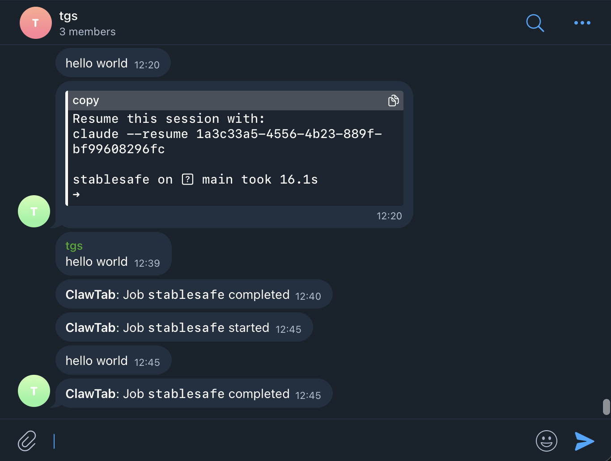

# Telegram Integration

ClawTab can send job notifications and accept commands through a Telegram bot. The app includes a guided setup wizard that walks you through each step.

## Setup

ClawTab has a built-in two-step setup flow in the Telegram panel:

### Step 1: Create a bot

1. Open [@BotFather](https://t.me/BotFather) in Telegram (the app provides a direct link)
2. Send `/newbot` and follow the prompts to name your bot
3. Copy the bot token BotFather gives you
4. Paste the token into ClawTab -- it validates automatically and shows `@your_bot_username` on success

The token field switches to a masked input once validated.

### Step 2: Connect chats

1. Click "Open @your_bot_username" to go to your bot in Telegram
2. Send `/start` to the bot (or add the bot to a group)
3. ClawTab polls for messages and auto-detects your chat ID within seconds
4. The chat appears in the "Connected chats" list with a Test button
5. Name each chat (e.g. "Personal", "Team") for easy identification
6. Click **Test** to verify -- you should receive a test message in Telegram

You can connect multiple chats. ClawTab polls for new chats every 3 seconds for up to 30 seconds, and you can click **Refresh** to poll again.



### Configuration

The setup wizard writes this to your `settings.yaml`:

```yaml
telegram:
  bot_token: "123456:ABC-DEF..."
  chat_ids: [12345678, 87654321]
  chat_names:
    "12345678": "Personal"
  notify_on_success: true
  notify_on_failure: true
  agent_enabled: true
```

## Notifications

Job notifications are sent automatically when jobs complete:

```
ClawTab: Job daily-backup completed
ClawTab: Job deploy failed (exit 1)
```

Toggle `Notify on job success` and `Notify on job failure` checkboxes in the Notifications section after setup.

### Per-Job Routing

Set `telegram_chat_id` on a job to route its notifications to a specific chat instead of the global `chat_ids` list.

### Real-Time Output Relay

For tmux jobs (Claude/Folder), the monitor captures pane output every 2 seconds and relays new lines to Telegram. Three relay modes are available per job:

| Mode | Behavior |
|------|----------|
| `off` | No output relay, only start/completion notifications |
| `always` | Every new output chunk is sent immediately |
| `on_prompt` | Output is buffered and sent when the pane goes idle (waiting for user input) |


## Agent Mode

When enabled in the Agent Mode section, ClawTab polls for incoming messages and responds to slash commands. Only messages from authorized `chat_ids` are processed.

### Commands

| Command | Action |
|---------|--------|
| `/help` or `/start` | Show available commands |
| `/jobs` or `/list` | List all jobs with type, cron, enabled status |
| `/status` | Show all job statuses with timestamps |
| `/run <name>` | Trigger a job |
| `/pause <name>` | Pause a running job |
| `/resume <name>` | Resume a paused job |

### Polling Behavior

- Agent uses long-polling with 30-second timeout, polling every 8 seconds
- Agent polling and setup polling are mutually exclusive
- During Telegram setup in the GUI, agent polling pauses to avoid competing for `getUpdates`
- Resumes automatically when setup completes

## Removing Telegram

The Danger Zone section at the bottom of the Telegram panel lets you remove all Telegram configuration (bot token, chat IDs). You will need to re-run the setup wizard to use Telegram again.
